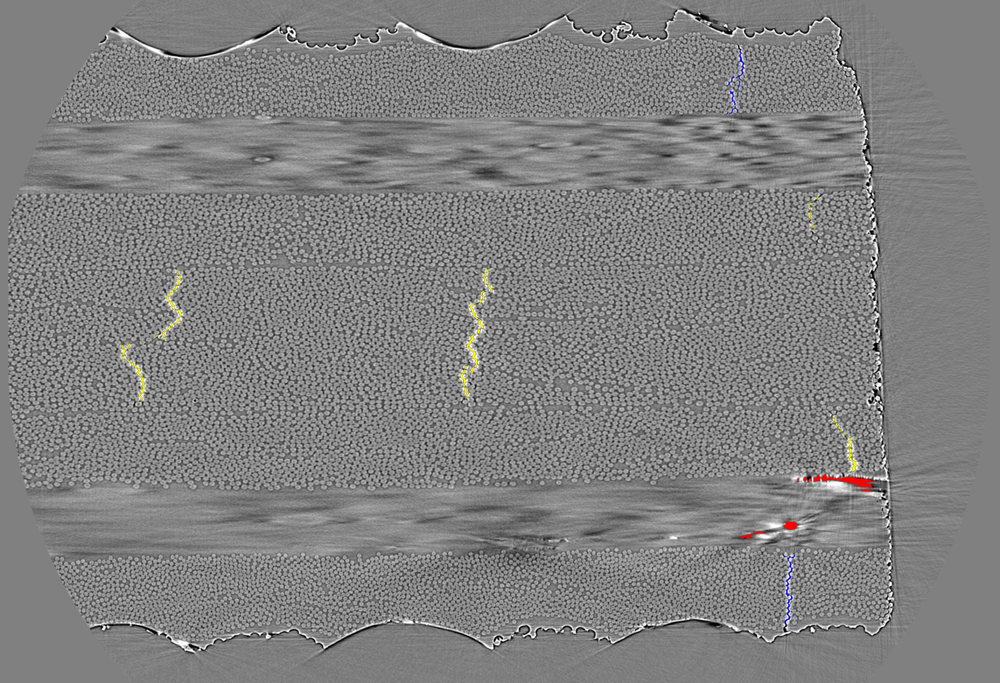

# necstlab Damage Segmentation in Multiscale Heterogeneous Materials

This repository (code base) contains the documentation and code to train and use a model for damage segmentation of advanced composite laminate micro-computed tomography slices. For example, this is a properly segmented 3-class slice (image):

## Workflows

To accomplish this, there are six workflows that this repository supports. Before completing any of these workflows, you'll need to [set up your local machine](docs/local_setup.md) and [set up your GCP bucket](docs/gcp_bucket_setup.md). You may also want to look through [assumed knowledge](docs/assumed_knowledge.md). 
1. [**data ingestion**](docs/data_ingestion.md): copying the raw data into a cloud bucket and logically structuring it
1. [**dataset preparation**](docs/dataset_preparation.md): preparing a dataset for use in training and testing
1. [**training**](docs/training.md): training a damage segmentation model on a dataset
1. [**training prediction thresholds**](docs/training_thresholds.md): training the prediction threshold(s) of a pretrained damage segmentation model on a dataset
1. [**testing**](docs/testing.md): testing the performance of a pretrained damage segmentation model on a dataset
1. [**inference**](docs/inference.md): segmenting the damage of an image stack or stack subset

## Policy for Code Base Modifications
For significant code changes to any files except `configs` and `.md`'s, users must:
1. Create new branch on github web browser
2. Refresh the local desktop client and switch to the new branch, 
3. Make the significant change in new branch
4. Commit change in local desktop client, 
5. Push commit to remote git (i.e., web browser) using local client
6. Create pull request in web browser with Josh Joseph as reviewer
7. Once approved, complete merge and then delete branch

# Known gotchas _(in-process)_
* You can only run a single workflow at a time on a VM (due to different runs possibly stepping on each other through the temp directory). [#27](https://github.com/mit-quest/necstlab-damage-segmentation/issues/27) will address this.
* You cannot run multi-GPU at max efficiency due to computation graph of python objects (custom metrics) being rebuilt for each batch. [#35](https://github.com/mit-quest/necstlab-damage-segmentation/issues/35) will address this.